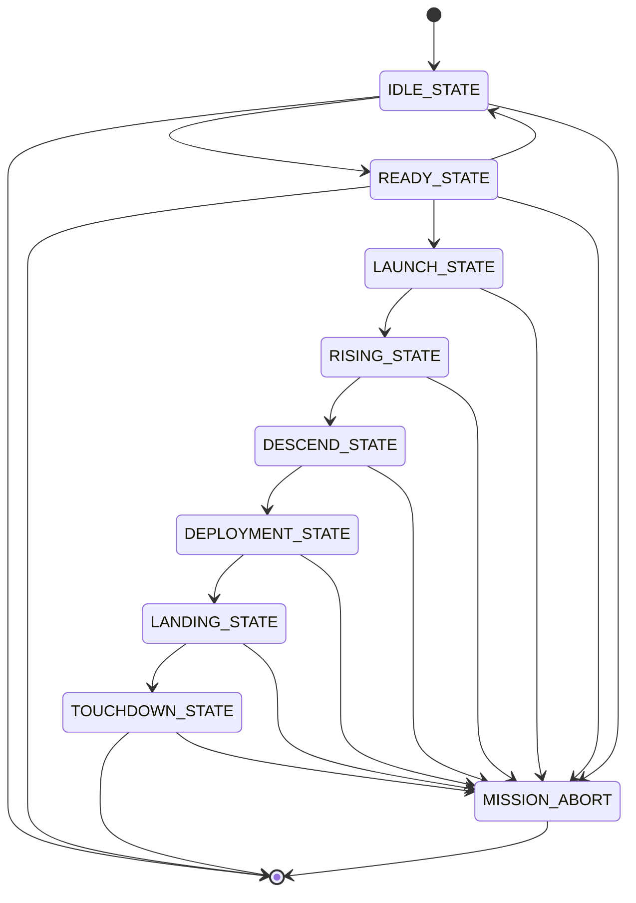
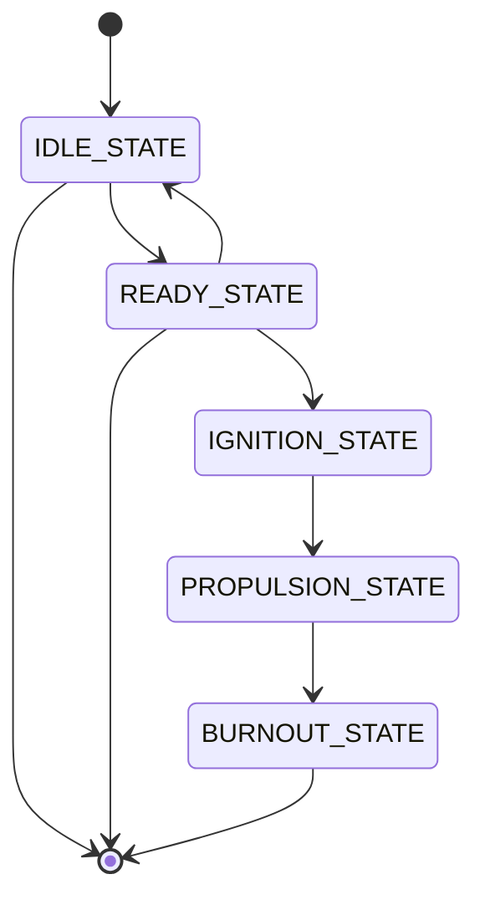
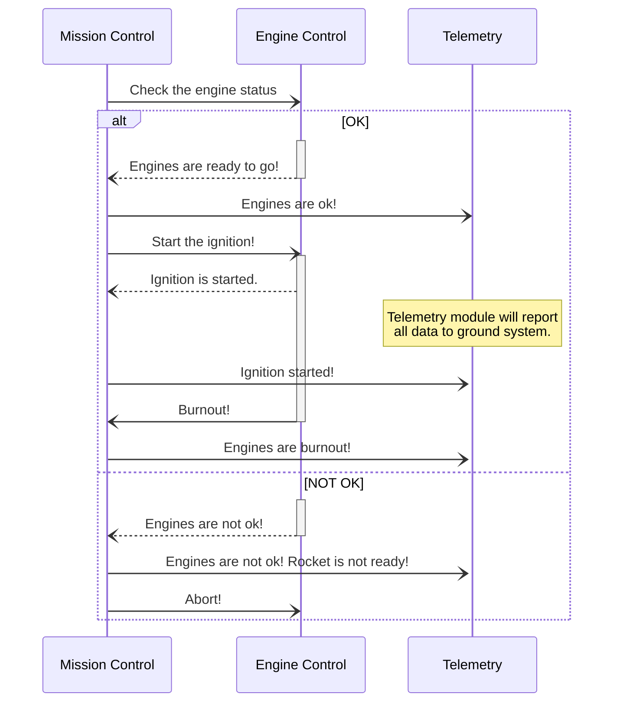

# Pike: Rocket System

Pike is a model rocket project that does not aim any military purpose. It is created as a hobby project and it will remain like that.

Mission of the Pike Rocket is to have computer guided cruising and landing after a successful launch.

**Note:** To render diagrams in this page, you may consider installing the [mercat](https://chrome.google.com/webstore/detail/mercat/jhclmndacaolijiipbpkmakjjgncjini) chrome extension.

## Table of Contents
- [Description](#description)
- [Roadmap](#roadmap)
- [Milestones](milestones.md)
- [System Design](#system-design)
    - [Engine Control](#engine-control)
    - [Deployment](#deployment)
    - [Telemetry](#telemetry)
    - [Navigation](#navigation)
    - [Mission Control](#mission-control)

# Roadmap

- **Engine Control**
    - [ ] Software Design of Sub-System
    - [ ] E-Match ignition
    - [ ] Ignition test of one engine
    - [ ] Ignition test of clustered engines
    - [ ] Burnout detection
    - [ ] Hardware Design
    - [ ] Assembly of Engine Section
    - [ ] Ground Test
- **Deployment**
    - [ ] Ignition of ejection charge

TODO: Roadmap will be updated later.

# System Design

System of the rocket consists of several sub-systems that are explained below. As of today (01/08/2021) CANBUS is selected as a main communication channel between all sub-systems. Reason of this choice is supported with the [white paper](using-can-bus-in-space-flight-applications.pdf) by Renesas Electronics.

Main system design is based on creating a distributed processing power for each function in the system itself.

System states are described in the [table](#table-1-system-states) below.

<figcaption align="center" id="table-1-system-states">Table 1. System States</figcaption>

|        State Name        	| Description                                                                                                                 	|
|:-------------------:	|-----------------------------------------------------------------------------------------------------------------------------	|
|      IDLE_STATE     	| The system shall read and report voltage and current information of peripherals and itself. But shall not take any action.  	|
|     READY_STATE     	| The system shall initialize all the subsystems and check all modules.                                                       	|
|     LAUNCH_STATE    	| The system shall initiate engine firing if there is no error in modules.                                                    	|
|     RISING_STATE    	| The system shall check the sensors to be able to detect state events.                                                       	|
|    DESCEND_STATE    	| The system shall deploy the first parachute and keep track of altitude and acceleration to take an action for state change. 	|
|   DEPLOYMENT_STATE  	| The system shall deploy the second parachute.                                                                               	|
|    LANDING_STATE    	| The system shall keep track of altitude and acceleration.                                                                   	|
|   TOUCHDOWN_STATE   	| The system shall check all the peripherals and shutdown.                                                                    	|
| MISSION_ABORT_STATE 	| The system shall take an action according to previous state.                                                                	|

Note that in each state system will report status of each sub-system using telemetry.

## Engine Control
Engine Control subsystem is responsible for firing the engine, controlling current status and informing the mission control subsystem.

<figcaption align="center" id="table-1-system-states">Table 2. Engine Control States</figcaption>

|Sub-System State Name | Description | System State Name |
|:--------------------:|:------------|:-----------------:|
|IDLE_STATE|The sub-system shall check voltage status and continuity of ignition systems. But shall not take any action other than reporting.|IDLE_STATE|
|READY_STATE|The sub-system shall prepare itself for ignition.|READY_STATE|
|IGNITION_STATE|The sub-system shall start ignition.|LAUNCH_STATE|
|PROPULSION_STATE|The sub-system shall check burnout detection sensors and control the stability.|RISING_STATE|
|BURNOUT_STATE|The sub-system shall inform mission control about the detection of burnout.|RISING_STATE|

## Deployment
TODO: Not decided yet
## Telemetry
TODO: Not decided yet
## Navigation
TODO: Not decided yet
## Mission Control
TODO: Not decided yet

## Communication

